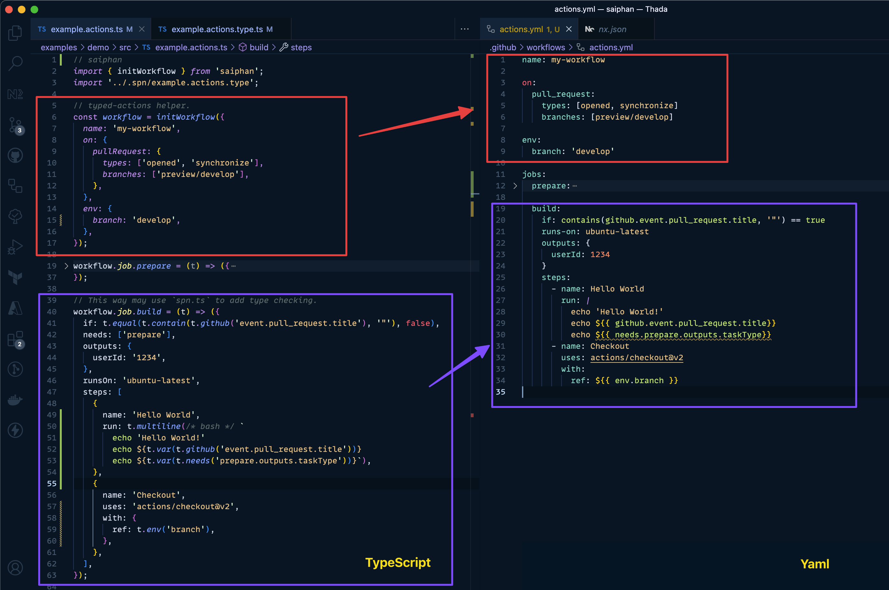

# Saiphan
Write Github Actions workflows with type-safe confidence and testable 

> This project in under development and proof and concept phase.

## Description
Saiphan (สายพาน in Thai, pronounced `/sai pan/`, means **Conveyor Belt** in Thai) is GitHub Actions Tool for writing type-safe confidence and testable GitHub Actions [Job](https://docs.github.com/en/actions/using-workflows/workflow-syntax-for-github-actions#jobsjob_idif) and [Step](https://docs.github.com/en/actions/using-workflows/workflow-syntax-for-github-actions#jobsjob_idstepsif) composition.



## Background

The complex GitHub Actions lead the hard way to maintain and test in unit of *Job*, the GitHub Actions Workflow *Job* composite together, it's hard to make sure the whole workflows will act correct in all possible condtion. 

Consider the following example below:

```yaml
jobs:
  # ... The rest job
  notify:
    if: |
      always() && 
      needs.get-pull-request-metadata.result == 'success' &&
      (needs.deploy-web.result == 'success' || needs.deploy-web.result == 'skipped') &&
      (needs.deploy-mobile-api.result == 'success' || needs.deploy-mobile-api.result == 'skipped') &&
      (needs.deploy-api.result == 'success' || needs.deploy-api.result == 'skipped') &&
      (needs.deploy-auth-gateway.result == 'success' || needs.deploy-auth-gateway.result == 'skipped') &&
      (needs.run-db-migration.result == 'success' || needs.run-db-migration.result == 'skipped')
    runs-on: "ubuntu-20.04"
    needs: [deploy-web, deploy-mobile-api, deploy-api, deploy-auth-gateway, run-db-migration, get-pull-request-metadata]
    steps:
      - run: ./do-some-thing
```

How we test all possible condition available on `if` condition before entering the job?

Why not?
- [act](https://github.com/nektos/act) - Provide tools for running GitHub Actions locally, however, they require to run the whole workflow, unit test in each job not provided.
- [Dagger Node.js](https://dagger.io/blog/nodejs-sdk) - Provide container-baed solution for supporting multiple languages, however, all `Dagger` code must be inside a single job, it cannot leverage job composition in GitHub Actions.


## How does it work?

- Background
    - TypeScript is imperative language, all variables must be in sequences.
    - GitHub Actions, is declarative, it’s not in sequences
- Problem: Type inference cannot work in compile time, because they need to refer to declarative way
    - Using background process to prepare type for compile time,
    - 3 Main mechanism:
        - Load GitHub Actions open source for getting `input` and `output` props (Support private repo later)
        - Compile → Declarative GitHub Actions to TypeScript  imperative code for run time execution and unit testing
        - Build → Compile to `yaml` file to publish.
        - Note: consider `AST` (Abstract Syntax Tree) for store metadata to convert.
- Next step:
    - How to parse mock data
    - generate unit test from workflow object


## Work Expectable

- Each job should be with unit test by mocking all inputs value from workflows event.
- Type-safe experience for writing the Github Actions Workflows

## Inspiration 
- [cicada](https://github.com/cicadahq/cicada) - TypeScript CI/CD tools for thier cloud

## Author
- Thada Wangthammang, Software Engineer, Thailand
